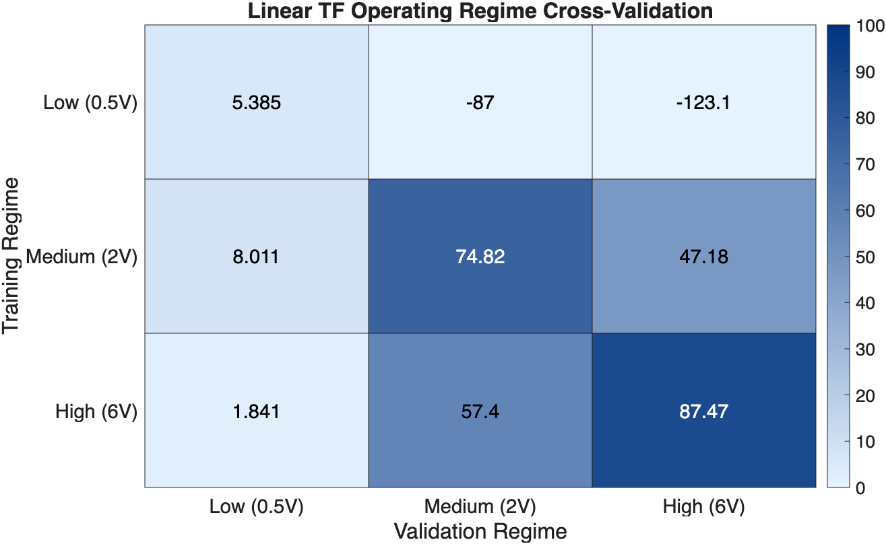
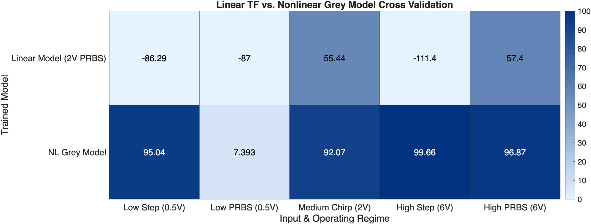
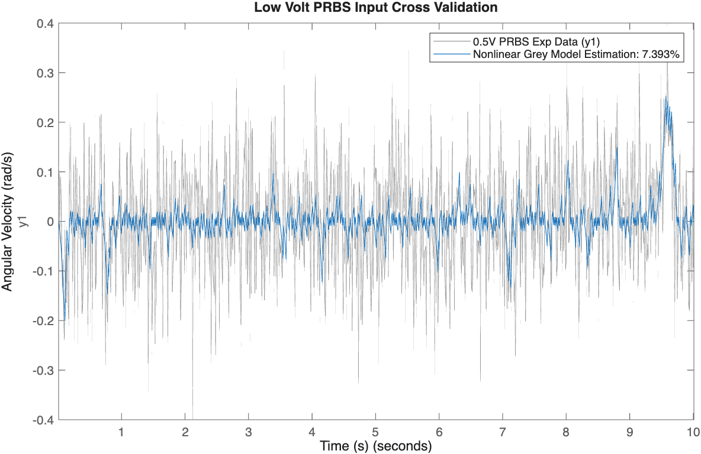

# System-Identification of DC Motor
## Project Overview
Direct experimentation on a given DC motor using a low (0.5V), medium (2V), and high (6V) voltage step, chirp, and PRBS input signal results in angular velocity responses capable of training linear and nonlinear models to identify motor dynamics. Linear models trained on one operating condition fail to generalize to other regions due to nonlinear friction and saturation. Cross validation shows that a physics-backed grey model approach increases accuracy to >90% across all voltage regimes while simultaneously estimating model parameters.

## Analysis
### Linear TF Cross Validation
Second order TF models are trained using PRBS signals across the 3 chosen voltage conditions. **The linear models perform well when validated and trained within the same voltage condition, but degrade when validated against voltages outside the training set, indicating nonlinear plant dynamics and motivating the development of a nonlinear grey model.** The low voltage models show significant errors compared to the medium and high regimes, since the nonlinear stiction dominates in low voltage, heavily altering dynamic behavior.

  

### Nonlinear Grey Model
A physics based nonlinear grey model is developed to train using various voltages and input types, allowing for direct estimation of motor parameters, which are identified within 25% error on linear terms and 35-50% on nonlinear parameters despite measurement noise.

  
| Parameter | True Value | Identified Value | Std Deviation | Error (%) |
| :--- | :---: | :---: | :---: | :---: |
| `b` (Viscous Damping) | 0.004 | 0.005 | 0.001 | **+22.69%** |
| `J` (Rotor Inertia) | 0.012 | 0.015 | 0.002 | **+22.69%** |
| `Kt` (Torque Constant) | 0.1 | 0.123 | 0.016 | **+22.84%** |
| `Fc` (Coulomb Friction) | 0.02 | 0.025 | 0.003 | **+24.01%** |
| `Fs` (Static Friction) | 0.035 | 0.047 | 0.009 | **+34.92%** |
| `vs` (Stiction Velocity) | 0.1 | 0.052 | 0.016 | **-48.42%** |

**The nonlinear grey estimation accurately predicts the motor response across a broad range of voltages and input types as compared to the linear model by directly modeling dynamics and nonlinear friction, resulting in >90% fit metrics.**

  

**Despite the 7% fit metric, the nonlinear grey model accurately predicts the low voltage PRBS signal response since low amplitude, high frequency voltage switching keeps the motor operating in the stiction deadband and near zero velocity.** Measurement noise creates a low SNR and skews the fit metric. At ~9.5s, the model accurately tracks a response where the motor is commanded long enough to break out of the friction regime, validating the model at low voltages despite the 7% fit metric.

  

